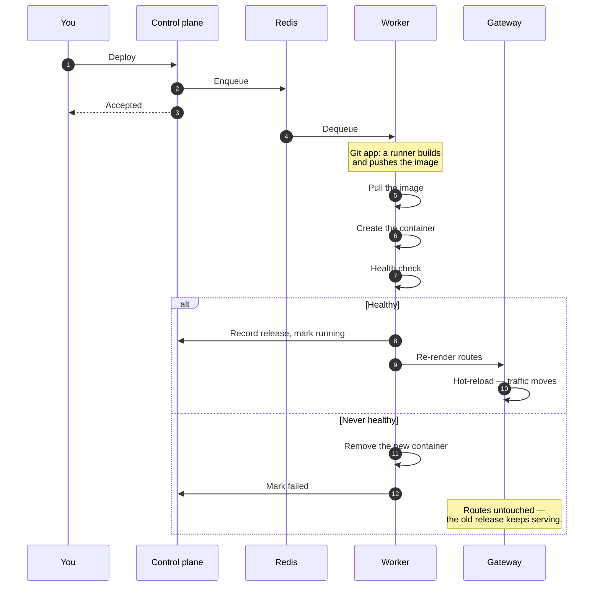

# Deployment pipeline

A deploy is an API call that returns immediately and a job that does the work. Nothing about a build
or an image pull happens inside your HTTP request.

## What this buys you

**A failed deploy is not an outage.** The new container has to pass its health check before the
routes are re-rendered. Until then the previous release is still the one behind the gateway, and a
deploy that never comes up leaves it there.

**The strategy decides the overlap.** Rolling starts the new container before stopping the old one;
recreate stops first, which is what a published host port forces because two containers cannot bind
the same port. [Canary](/docs/applications/canary-deployments) runs both at once and splits traffic
between them.

**Builds never run on a hosting node.** A Git-source deploy hands the build to a registered
[runner](/docs/cicd/runners), which pushes the image to the registry; the node only pulls it. With no
runner available the deploy waits, and fails once `MIABI_RUNNER_WAIT_TIMEOUT_MINUTES` (default 30)
passes — there is no local-build fallback. That is what keeps a heavy build from competing with the
apps already running on a node.

**Deploys of one app never overlap.** Each deploy takes a per-application lock in Redis; a second
deploy of the same app waits its turn instead of racing the first for the release version and the
container swap, even across several workers. Deploys are also rationed per cluster, so a slow
region cannot hold every worker slot.

## Following a deploy

The deployment's log is streamed live and each stage is recorded on the app's
[timeline](/docs/applications/logs-and-timeline). When a deploy fails, that log names the stage —
`pulling image`, `creating container`, health check — which is usually enough to know whether the
problem is your image, your registry credentials, or your application.
