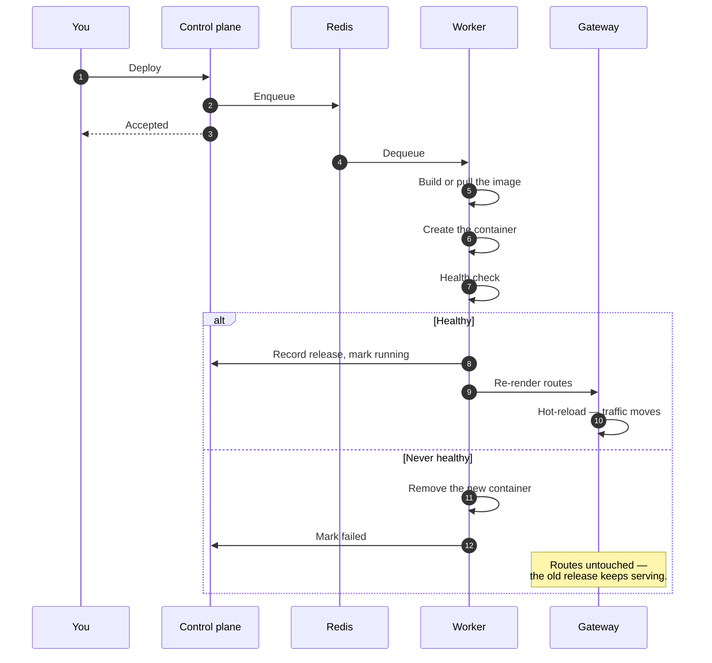

# Deployment pipeline

A deploy is an API call that returns immediately and a job that does the work. Nothing about a build
or an image pull happens inside your HTTP request.

## What this buys you

**A failed deploy is not an outage.** The new container has to pass its health check before the
routes are re-rendered. Until then the previous release is still the one behind the gateway, and a
deploy that never comes up leaves it there.

**The strategy decides the overlap.** Rolling starts the new container before stopping the old one;
recreate stops first, which is what a published host port forces because two containers cannot bind
the same port. [Canary](/docs/applications/canary-deployments) runs both at once and splits traffic
between them.

**Build location is a choice.** Without a [runner](/docs/cicd/runners), the image is built on the
node running the deploy. With one, the build is handed off — which is what keeps a heavy build from
competing with the apps already running on that node.

## Following a deploy

The deployment's log is streamed live and each stage is recorded on the app's
[timeline](/docs/applications/logs-and-timeline). When a deploy fails, that log names the stage —
`pulling image`, `creating container`, health check — which is usually enough to know whether the
problem is your image, your registry credentials, or your application.
