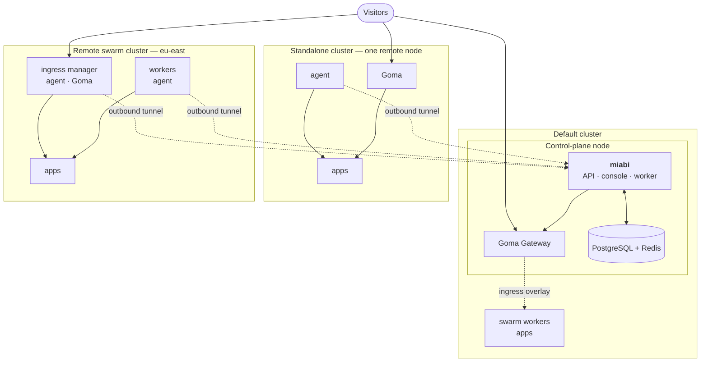

# Multi-node & clusters

One node is the default and the whole platform. Adding more changes where containers run, not how
you use Miabi: a single control plane drives every node, grouped into **clusters**.

## Clusters

Every node belongs to exactly one cluster. A cluster is the unit that shares private networking and a
gateway, and there are three shapes:

| Cluster | What it is | Gateway serving its apps |
|---|---|---|
| **Default** | The control-plane node, plus every node that joins its swarm | The control plane's Goma Gateway |
| **Standalone** | One remote node connected to the manager over its agent tunnel. Every node you add starts as one | The node's own Goma (edge gateway) |
| **Remote swarm** | A Docker Swarm of remote nodes, made by enabling Swarm on a standalone node and joining others to it | The Goma on the swarm's ingress node |

Workspaces see clusters as **locations**. A new app, database, volume or stack is placed in a location,
then on a node inside it; see [Locations](/docs/nodes/cluster-mode#locations). Nothing crosses clusters
at runtime: networks, volumes and database links stay inside one, and a reference to another location
is refused. With an Enterprise license, a plan can bind its workspaces to locations and a
[node pool](/docs/nodes/cluster-mode#node-pools).

## The tunnel goes outward

The agent dials the control plane, not the other way round. That single decision is what makes a
homelab box, a NAT'd VPS or a machine behind a corporate firewall usable as a node: **no inbound
port, no exposed Docker socket, no VPN**.

Once connected, the control plane holds a live Docker API client for that node and uses it exactly as
it uses the local engine — the same code path creates a container whether it lands here or three
hops away.

Every remote node is reached this way, a remote swarm's managers included, so the control plane drives
a swarm in another region without opening a connection into that network. Miabi can install the agent
on every member of a swarm for you.

## How traffic reaches an app

Each cluster is served by its own gateway, and the DNS records for an app's routes point at it:

| Where the app runs | Gateway | DNS points at |
|---|---|---|
| Default cluster | The control plane's Goma, over the ingress overlay for swarm members | The cluster's public address |
| Standalone cluster | The node's own Goma | The cluster's public address |
| Remote swarm | The Goma on the swarm's ingress node, over that swarm's overlay | The cluster's public address |

Every app of the default cluster is served by the control plane's Goma, so its nodes run no gateway of
their own. A cluster's **public address** is an IP, or a hostname for a record that cannot use one, set in
the cluster's **Edit** dialog: its gateway, or a load balancer in front of it. A remote cluster learns the IP
from the public address its ingress node's agent connects from, until an administrator sets one.

A remote gateway pulls its routes from the control plane over HTTP with its own token and reloads on
demand, so routing and middleware definitions stay workspace-level wherever they are served. An
administrator picks a remote swarm's ingress node from the cluster's page.

A node's connectivity says whether it runs a gateway of its own:

| Node connectivity | Meaning |
|---|---|
| **Edge gateway** | The node runs its own Goma and serves its apps. New nodes are always added this way |
| **Cluster gateway** | The node runs no gateway: its cluster's gateway reaches its apps. The control-plane node and swarm members |

A node without public ports 80/443 should join a [swarm cluster](/docs/nodes/cluster-mode) as a worker,
where it is served by the cluster's gateway.

:::note Port forwarding is retired
Earlier releases could reach a node's apps through auto-allocated host ports. Upgrading converts such
a node to an edge gateway, or to a cluster-gateway node when it is a swarm member, and removes the
host ports Miabi held for it. The cluster page of a converted node then offers to keep its gateway or
join it to a swarm cluster. Port bindings requested for TCP apps and database port forwarding are
unchanged.
:::

A gateway close to its apps is the point: traffic for a distant node or region terminates there
instead of crossing the network twice.

## Swarm in each cluster

[Cluster mode](/docs/nodes/cluster-mode) promotes a cluster to a Docker Swarm, which adds encrypted
overlay networks spanning its nodes, replicated apps, and cross-node service discovery. Each cluster is
its own swarm: the default cluster's is auto-detected on the control-plane engine, and any other
cluster runs one on its manager node, driven over the agent tunnel. It is opt-in: a plain single-node
install behaves exactly as it did before, and nothing in the console asks you to think about Swarm.

A cluster other than the default one only takes and releases **empty** nodes, so its workspace networks
are overlays from the start. Deploys are rationed per cluster, so a slow region cannot hold every
worker slot.

:::note Growing is not a migration
Nodes, clusters and `workspace_id` scoping exist from the first install, so going from one node to
many, or from one cluster to several, adds rows — it never rewrites what is already there.
:::

## Technology stack

| Layer | Choice |
|-------|--------|
| Backend | Go, [Okapi](https://github.com/jkaninda/okapi) framework, REST + OpenAPI |
| ORM / DB | GORM over PostgreSQL |
| Cache / queue | Redis — cache, rate limiting, asynq queue, analytics stream |
| Scheduler | robfig/cron via a cron manager |
| Runtime | Docker Engine via the Moby Go client (`github.com/moby/moby/client`); Docker Swarm opt-in per cluster |
| Reverse proxy / TLS | Goma Gateway (routing + ACME); managed DNS-01 certs via go-acme/lego |
| Object storage | S3 (`aws-sdk-go-v2`) or filesystem |
| Metrics / logging | Prometheus client · `jkaninda/logger` |
| Frontend | Vue 3 + Pinia + Vite + TypeScript, embedded in the binary |
