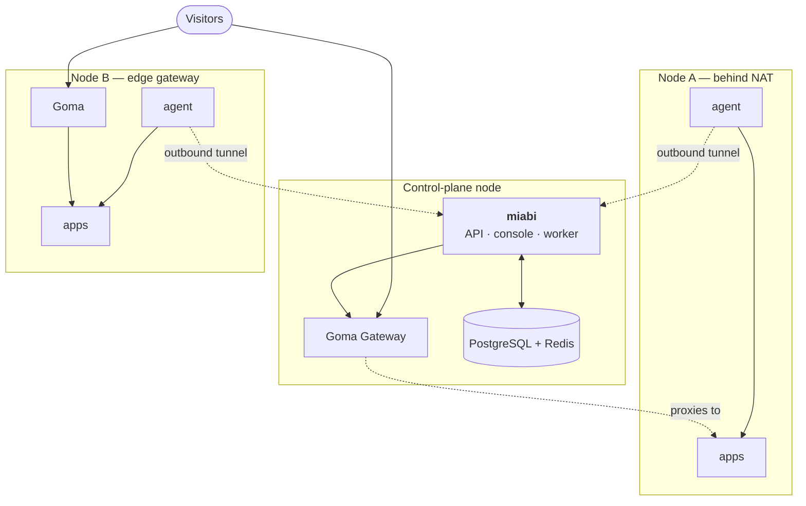

# Multi-node

One node is the default and the whole platform. Adding more changes where containers run, not how
you use Miabi.

## The tunnel goes outward

The agent dials the control plane, not the other way round. That single decision is what makes a
homelab box, a NAT'd VPS or a machine behind a corporate firewall usable as a node: **no inbound
port, no exposed Docker socket, no VPN**.

Once connected, the control plane holds a live Docker API client for that node and uses it exactly as
it uses the local engine — the same code path creates a container whether it lands here or three
hops away.

## How traffic reaches an app on a remote node

Two shapes:

| Node connectivity | How visitors reach its apps |
|---|---|
| **Edge gateway** | The node runs its own Goma instance and serves its apps directly |
| **Cluster gateway** | The node runs no gateway: its swarm cluster's gateway reaches its apps over the overlay network |

New nodes are always added as edge gateways. A node without public ports 80/443 should join a
[swarm cluster](/docs/nodes/cluster-mode) as a worker, where it is served by the cluster's gateway.

:::note Port forwarding is retired
Earlier releases could reach a node's apps through auto-allocated host ports. Upgrading converts such
a node to an edge gateway, or to a cluster-gateway node when it is a swarm member, and removes the
host ports Miabi held for it. The cluster page of a converted node then offers to keep its gateway or
join it to a swarm cluster. Port bindings requested for TCP apps and database port forwarding are
unchanged.
:::

An edge gateway is the one to choose when the node is geographically distant or on its own uplink —
traffic terminates there instead of crossing the network twice. Routing and middleware definitions
stay workspace-level either way; only the gateway rendering them differs. See
[Edge gateways](/docs/nodes/overview).

## Cluster mode

Enabling [cluster mode](/docs/nodes/cluster-mode) promotes the fleet to a Docker Swarm, which adds
encrypted overlay networks spanning nodes, replicated apps, and cross-node service discovery. It is
opt-in and auto-detected: a plain single-node install behaves exactly as it did before, and nothing
in the console asks you to think about Swarm.

:::note Growing is not a migration
The `Server` entity and `workspace_id` scoping exist from the first install, so going from one node
to many adds rows — it never rewrites what is already there.
:::

## Technology stack

| Layer | Choice |
|-------|--------|
| Backend | Go, [Okapi](https://github.com/jkaninda/okapi) framework, REST + OpenAPI |
| ORM / DB | GORM over PostgreSQL |
| Cache / queue | Redis — cache, rate limiting, asynq queue, analytics stream |
| Scheduler | robfig/cron via a cron manager |
| Runtime | Docker Engine via the Docker SDK for Go (optional Swarm cluster mode) |
| Reverse proxy / TLS | Goma Gateway (routing + ACME); managed DNS-01 certs via go-acme/lego |
| Object storage | S3 (`aws-sdk-go-v2`) or filesystem |
| Metrics / logging | Prometheus client · `jkaninda/logger` |
| Frontend | Vue 3 + Pinia + Vite + TypeScript, embedded in the binary |
