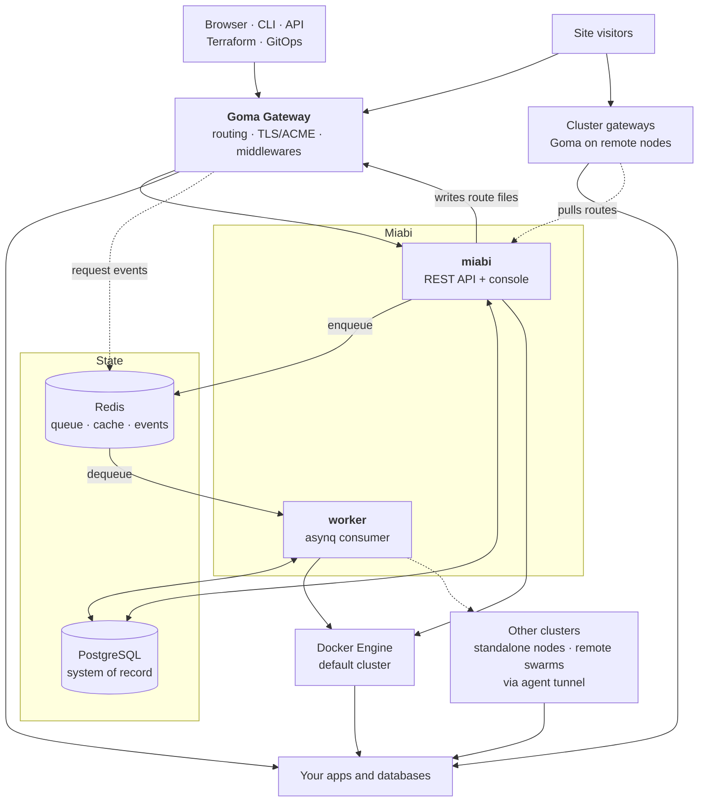

# Architecture

Miabi is one Go binary, a reverse proxy, and two datastores. Everything else — your apps, your
databases, remote nodes — is Docker containers it manages. This section explains how those pieces
fit together and what happens when you use them.

Two things in that picture are worth reading twice.

**Everything public goes through a Goma gateway.** App and database ports are not published on the
host unless a [host port binding](/docs/applications/exposing-your-app#method-3--a-published-host-port)
is approved, so a gateway is the only listening surface by default. The control plane's gateway serves the default
cluster, and Miabi configures it by writing route files into a watched directory — no API between the
two, no token to leak. Every other cluster is served by a gateway of its own on a remote node, which
pulls its routes from the control plane with its own token.

**The control plane never blocks on Docker.** Anything slow — a build, a deploy, a backup — is
enqueued and picked up by the worker, so an API request never waits on an image pull.

## Components

### Control plane (`miabi`)

A single Go binary on the [Okapi](https://github.com/jkaninda/okapi) framework. It serves the REST
API **and** the Vue console, which is compiled into the binary and served as a static SPA at `/`.
That is why a Miabi deployment is one image rather than a frontend and a backend.

### Worker

Long operations run on an [asynq](https://github.com/hibiken/asynq) consumer backed by Redis:
deploys, image builds, database provisioning, backups, housekeeping, GitOps syncs. It is **embedded
in the control plane by default** and can be split into its own process — same binary, `worker`
subcommand — when deploy volume warrants it. See
[Configuration](/docs/getting-started/configuration#the-background-worker).

### Goma Gateway

[Goma Gateway](https://github.com/jkaninda/goma-gateway) terminates TLS, issues certificates over
HTTP-01, applies middlewares, and routes to app containers over the shared proxy network, which an
app joins only while it has a route (a replicated service is reached over the cluster's ingress
overlay instead). Miabi writes per-route YAML into Goma's provider directory; Goma watches it and
hot-reloads. A standalone node, or a remote swarm's ingress node, runs its own Goma that pulls the
routes it serves over HTTP. See
[Routing & Middlewares](/docs/networking/routing-and-middlewares).

### Control manager

The control manager is what notices when a workload disappears from under Miabi — an app's
container gone from its node, a service app's swarm service gone from its cluster, or the volume
holding an app's or a database's data deleted. Every minute it compares what Miabi deployed with
what is running and reports the difference as app events, alerts and metrics. In `enforce` mode it
also redeploys a missing app **in place**, on the node or cluster it already ran on; it never places
or moves a workload. Lost data is never repaired unattended: an app or database whose volume is gone
is refused a start until the data is restored, because Docker would otherwise hand it a new, empty
volume. See [Reconciliation](/docs/operations/reconciliation).

### Leader election

Some control-plane work must run exactly once: scheduled jobs, periodic scans, cluster
reconciliation and the control manager's sweep. The server process that holds a short leader lease
in Redis runs it, and renews the lease while it does; a second control plane started against the
same Redis stands by until the lease frees. It is not multi-replica high availability — agent and
runner tunnels still belong to the process they dialled, and a dedicated `worker` never leads. See
[Leader election](/docs/operations/reconciliation#leader-election).

### Node agent

A remote Docker host joins by running the [agent](/docs/nodes/agent), which dials **outbound** to the
control plane over a WebSocket tunnel and proxies the local Docker socket back through it. Outbound
means no inbound firewall rule and no public Docker socket — a node behind NAT works unchanged. A
remote swarm's managers are reached the same way. See [Multi-node & clusters](/docs/architecture/multi-node).

### Clusters

One control plane drives many clusters. The **default cluster** is the control-plane node and its
swarm members. Every remote node starts as a **standalone cluster** of its own, connected to the manager
over its agent tunnel and serving its apps through its own gateway; enabling Swarm on one makes it a
**remote swarm** that other nodes join. Workspaces see clusters as **locations**, and private networks,
volumes and database links never cross from one to another.

### Datastores

- **PostgreSQL** is the system of record for every resource. Schema migrations run on startup, with
  a versioned upgrade-step system for data migrations — see [Upgrades](/docs/upgrades/overview).
- **Redis** carries the asynq queue, the cache, rate limiting, session revocation, and the analytics
  event stream the gateway writes to.

## Design principles

- **API first.** Every feature is an API; the console is one consumer, the CLI and Terraform provider
  are others. Nothing exists only in the UI.
- **Docker first.** Docker is the runtime. A plain single-node Docker install must keep working
  exactly as it does today.
- **Multi-tenant by construction.** Workspace scoping is enforced in the repository layer, not only
  in middleware, so a missing check fails closed.
- **Self-hosted first.** One VPS is a first-class deployment, not a degraded one.

## Where to go next

- [Request lifecycle](/docs/architecture/request-lifecycle) — what happens between a visitor and your container.
- [Deployment pipeline](/docs/architecture/deployment-pipeline) — what happens when you press Deploy.
- [Multi-node & clusters](/docs/architecture/multi-node) — how clusters, remote nodes and their gateways fit in.
