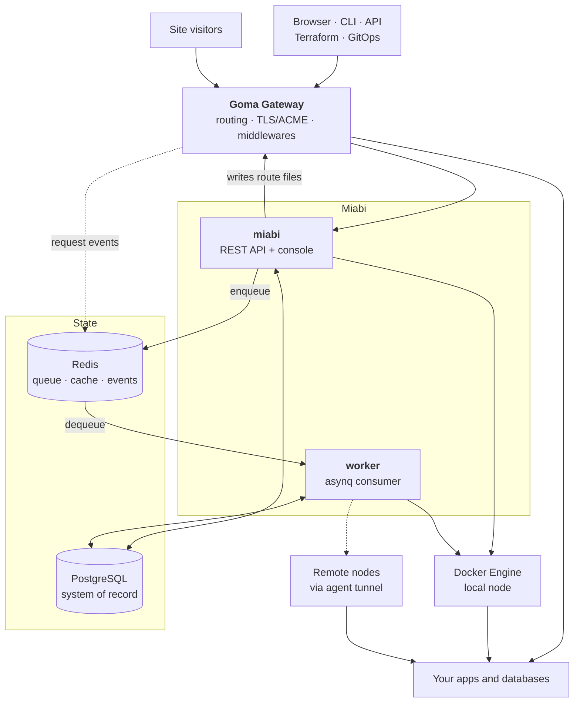

# Architecture

Miabi is one Go binary, a reverse proxy, and two datastores. Everything else — your apps, your
databases, remote nodes — is Docker containers it manages. This section explains how those pieces
fit together and what happens when you use them.

Two things in that picture are worth reading twice.

**Everything public goes through Goma.** App and database ports are never published on the host, so
the gateway is the only listening surface. Miabi configures it by writing route files into a watched
directory — there is no API between the two, and no token to leak.

**The control plane never blocks on Docker.** Anything slow — a build, a deploy, a backup — is
enqueued and picked up by the worker, so an API request never waits on an image pull.

## Components

### Control plane (`miabi`)

A single Go binary on the [Okapi](https://github.com/jkaninda/okapi) framework. It serves the REST
API **and** the Vue console, which is compiled into the binary and served as a static SPA at `/`.
That is why a Miabi deployment is one image rather than a frontend and a backend.

### Worker

Long operations run on an [asynq](https://github.com/hibiken/asynq) consumer backed by Redis:
deploys, image builds, database provisioning, backups, housekeeping, GitOps syncs. It is **embedded
in the control plane by default** and can be split into its own process — same binary, `worker`
subcommand — when deploy volume warrants it. See
[Configuration](/docs/getting-started/configuration#the-background-worker).

### Goma Gateway

[Goma Gateway](https://github.com/jkaninda/goma-gateway) terminates TLS, issues certificates over
HTTP-01, applies middlewares, and routes to app containers on the workspace network. Miabi writes
per-route YAML into Goma's provider directory; Goma watches it and hot-reloads. See
[Routing & Middlewares](/docs/networking/routing-and-middlewares).

### Node agent

A remote Docker host joins by running the [agent](/docs/nodes/agent), which dials **outbound** to the
control plane over a WebSocket tunnel and proxies the local Docker socket back through it. Outbound
means no inbound firewall rule and no public Docker socket — a node behind NAT works unchanged. See
[Multi-node](/docs/architecture/multi-node).

### Datastores

- **PostgreSQL** is the system of record for every resource. Schema migrations run on startup, with
  a versioned upgrade-step system for data migrations — see [Upgrades](/docs/upgrades/overview).
- **Redis** carries the asynq queue, the cache, rate limiting, session revocation, and the analytics
  event stream the gateway writes to.

## Design principles

- **API first.** Every feature is an API; the console is one consumer, the CLI and Terraform provider
  are others. Nothing exists only in the UI.
- **Docker first.** Docker is the runtime. A plain single-node Docker install must keep working
  exactly as it does today.
- **Multi-tenant by construction.** Workspace scoping is enforced in the repository layer, not only
  in middleware, so a missing check fails closed.
- **Self-hosted first.** One VPS is a first-class deployment, not a degraded one.

## Where to go next

- [Request lifecycle](/docs/architecture/request-lifecycle) — what happens between a visitor and your container.
- [Deployment pipeline](/docs/architecture/deployment-pipeline) — what happens when you press Deploy.
- [Multi-node](/docs/architecture/multi-node) — how remote nodes and edge gateways fit in.
