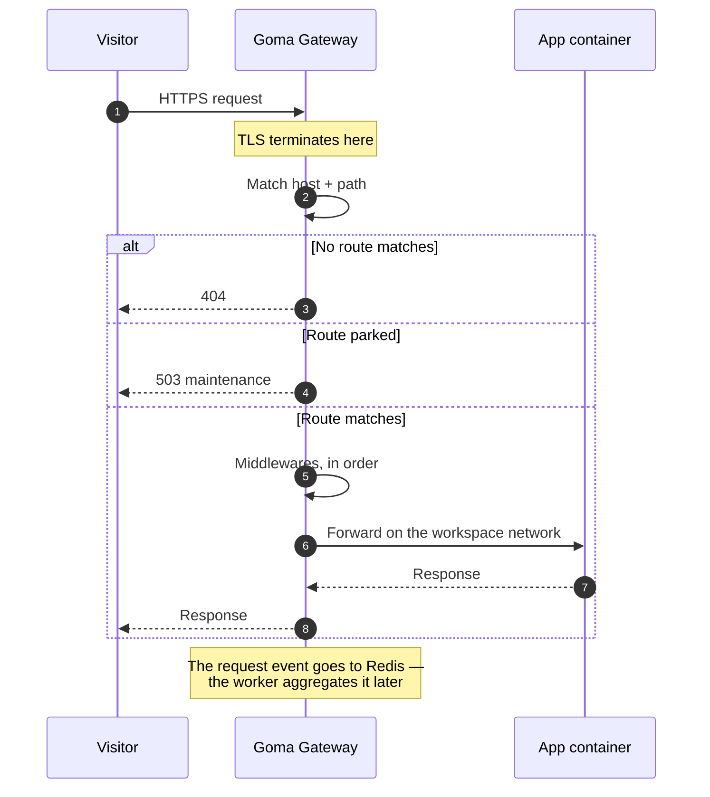

# Request lifecycle

Every public request takes the same path. Knowing it is the difference between debugging a 502 in a
minute and guessing for an hour.

## Where each step can fail

| Symptom | Step | Cause |
|---|---|---|
| Connection times out | 1 | DNS does not point at the gateway node, or 80/443 is firewalled |
| Certificate warning | 2 | ACME has not completed — HTTP-01 needs port 80 reachable |
| 404 from the gateway | 3 | The `Host` header matches no route, or the path prefix does not match |
| 401 / 429 | 6 | A middleware answered before the backend was reached |
| 502 | 7 | The container is not listening on the declared port, or it crashed |

The route's own status tells you whether the gateway is even trying: a route on an unverified domain
is **offline** and never reaches step 3. See
[Exposing an application](/docs/applications/exposing-your-app).

## Why the gateway is the only listener

App and database containers publish nothing on the host. They are reachable only on their workspace's
Docker network, which the gateway is also attached to. That has three consequences worth knowing:

- **Scanning the host finds nothing but the gateway.** There is no accidental exposure of a database
  because someone forgot a firewall rule.
- **Two workspaces cannot reach each other**, because they are different Docker networks.
- **Reaching an app without the gateway means asking for it explicitly** — a
  [host port binding](/docs/applications/exposing-your-app#method-3--a-published-host-port), which a
  platform admin has to approve.

## Analytics are out of band

Steps 10-12 happen after the response has already been sent. The gateway writes request events to a
Redis stream and the worker aggregates them into minute buckets — so
[analytics](/docs/operations/analytics) never sit in the request path, and losing the worker costs
you statistics rather than traffic.
